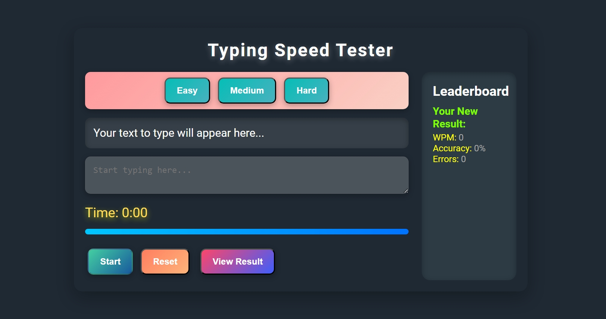

# ProTypist

ProTypist is a sleek and efficient typing speed tester platform designed to help users measure and improve their typing accuracy and speed. With engaging tests, real-time results, and an exciting leaderboard system, ProTypist enhances the typing experience for users of all skill levels.

---
## Output

## 🚀 Features

- **Real-Time Feedback**: Get instant results on your typing performance.
- **Accurate Stats**: Monitor your speed and accuracy for consistent improvement.
- **Difficulty Levels**: Choose the challenge that fits your skills.
- **Leaderboard System**: Compete with friends and climb to the top.
- **Responsive Design**: Enjoy a seamless experience on any device.

---

## 📖 How to Use

1. Visit the website and navigate to the homepage.
2. Select your preferred difficulty level.
3. Start typing the text displayed on the test page.
4. View your performance results instantly upon completion.

---

## 💻 Demo

Check out the live demo of the ProTypist platform: [ProTypist Demo](https://get-unknown-err0r.github.io/protypist-typingspeed-checker-site/)

---

## 📂 File Structure

